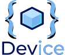
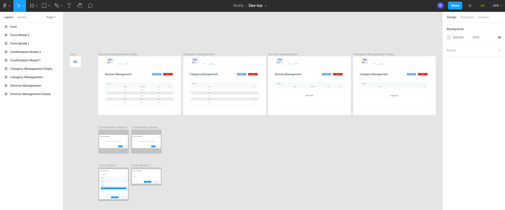
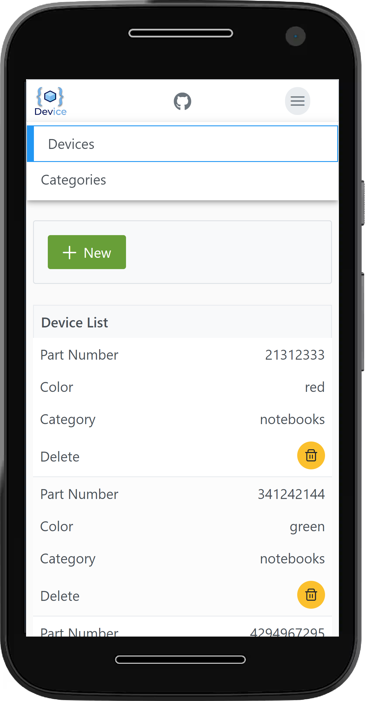
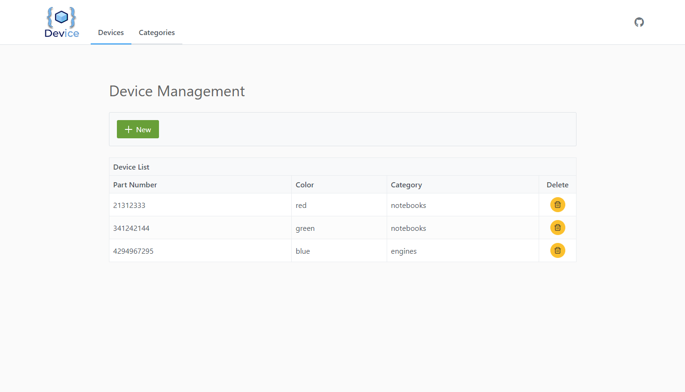

# Dev-ice - A simple Web app to organize your devices...

# Overview

This project was made for a code challange of Eldorado Institute.
The users requirement is a simple app to manage (see, save and delete) devices and their categories.
No need to have authentication or to be able to update de fields of devices and their categories.

## Development Requirements

✔️ Persist data in a MySQL Database

✔️ Front end implemented with Angular

✔️ Back end with Nodejs

✔️ Must provide script to create the database

✔️ Git with public repo

✔️️ Must have screens to create, list and delete categories and devices

✔️ Devices and Categories have multiple validation fields

✔️ All fields are mandatory and Devices and Categories have a relation many to one

✔️ Web app must have menu with Category Management and Device Management

### PLUS

✔️ Automated test in the back end

✔️ Deployment in AWS

## Development Overview

Besides the requirements, more side objectives were achieved, mostly regarding tests, codebase organization, automation and standardization. It's worth mentioning that the use of Nest.js also contibuited a lot, considering the 'same' conventions and DI engine as Angular, providing code with high coesion and low coupling, perfect to unittest. The back end was deployed as a docker container in AWS Elastic Beanstalk PaaS, and the front end in AWS S3 buckets. The code was glued up with Nx, a monorepo framework, the releases were managed by semantic-releases and everything was automated using github actions.

### Codebase organization

To keep the git repository organized and with homogeneous commits, some tools and methodology were applied.

The whole process followed used three branches: main, beta and develop (something similar with git flow).

To ensure standardization of the commits, the library [commitizen](https://github.com/commitizen/cz-cli) and [git-commit-msg-linter](https://github.com/legend80s/commit-msg-linter) were used, forcing the use of [conventional commits](https://www.conventionalcommits.org/en/v1.0.0/).
[Husky](https://github.com/typicode/husky) was used to trigger events with git hooks.

[Semantic-release](https://github.com/semantic-release/semantic-release) was used together with github actions and the conventional commits to generate automatically the releases and changelogs.

The use of the monorepository framework [Nx](https://github.com/nrwl/nx) also helped with the codebase organization as it comes with shared eslint and prettier configuration, and allows code share by default between the projects.

[lint-staged](https://github.com/okonet/lint-staged) was also used together with husky to lint, test and format all the staged code before commit and deploy.

### Testing

Jest was the testing library used to test the Angular app and the Nest.js backend. Coverage reports are open, and are provided by [codecov](https://about.codecov.io/). Just click in the badge.
The back end has 100% coverage. Unit tests were made in the controllers and services, and a Docker conteiner with a MySQL image was used to make the backend e2e tests using [supertest](https://github.com/visionmedia/supertest) library. A [swagger-ui](https://swagger.io) app can also be used in development for testing and documentation.

The front end had it's services fully tested, but the components are not.

### Automation

Github Actions came to the rescue and was used through the whole project. It is responsible to the cool badge Test-Build up there, as well as for the build and deploy of the back end in Elastic Beanstalk, build of the Angular app and deploy of the static files, coverage tests and uploading to codecov, and last but not least, the auto versioning and releases with semantic-release's bot.

### Figma

[The draft of the design](https://www.figma.com/file/d3sxMLD2WdYIjqQmLfopTx/Dev-Ice), as well as the super cool Logo (Thank's Caio ma friend) is accessible through the Figma Web App. The Design Library [PrimeOne](https://www.figma.com/community/file/890589747170608208) from Primefaces was used, and it is the design base of PrimeNg, the UI library used in this project.

### Responsiveness

It was choosen the use PrimeNg/Primeflex/Primeicons as UI library. Although some customizations were needed, it was very productive, considering that most of its components are responsive out of the box:

## Development Environment

This app requires a MySQL database for testing, commiting and pushing (lint-stage + husky ftw). You can use a mysql server locally with after creating a user "tester" with password "test" and a database "test", and grant it permission.

Other alternative is to run it with Docker using the command `docker run --name device-mysql -p 3306:3306 -e MYSQL_ROOT_PASSWORD=my-secret-pw -e MYSQL_DATABASE=test -e MYSQL_USER=tester -e MYSQL_PASSWORD=test -d mysql:latest`

You can then stop the container if you want with `docker stop device-mysql` and remove with `docker rm device-mysql`. The container port is mapped to default port of mysql (3306). So, if you want to use it, you need to stop the mysql server service before. In linux, the command is `service mysql stop`.

You can also run it in interative mode by changing the tag `-d` by `-it`.

More infos in the [MySQL official image](https://hub.docker.com/_/mysql) in the DockerHub.

## Tecnologies list

- Typescript
- Nest.js
- Angular
- MySQL
- TypeORM
- Nx
- PrimeNg/Primeflex
- AWS RDS
- AWS Elastic Beanstalk
- AWS S3
- Docker
- Github Actions
- Codecov
- Jest
- supertest
- Semantic-release
- Commitizen
- lint-staged
- Husky
- git-commit-msg-linter
- swagger
